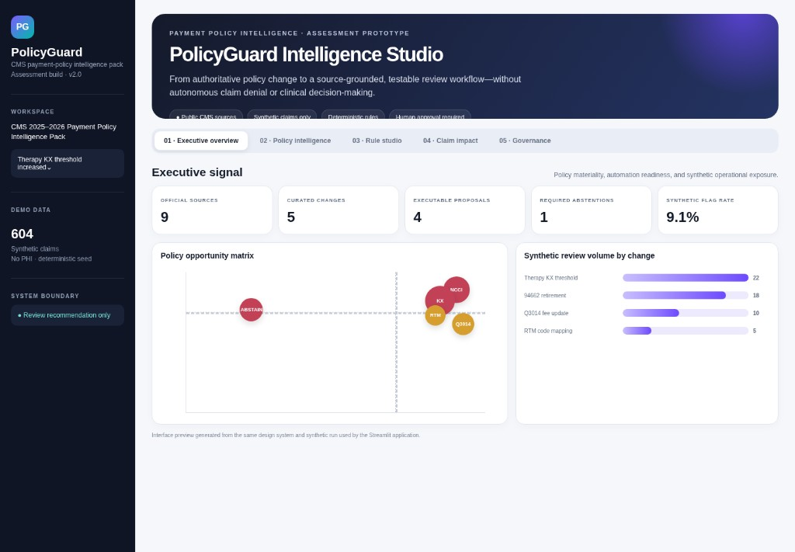

# PolicyGuard

**Interpret a healthcare billing-policy change once — with source evidence, a validated review rule or an explicit abstention, and a human gate — instead of re-reading the policy on every claim.**

PolicyGuard is a human-in-the-loop proof of concept. It **flags synthetic claims for review**. It does **not** make autonomous clinical, payment, or claim-denial decisions.

**Live demo:** [https://cotiviti-policyguard-haorui-wang.streamlit.app/](https://cotiviti-policyguard-haorui-wang.streamlit.app/) — hosted from the same `main` branch as this repository. GitHub remains the official submission (report, slides, video, and resume stay in-repo).



## Assessment

| | |
| --- | --- |
| **Program** | Cotiviti Generative AI Research Intern Assessment |
| **Topic** | Topic 3 — Content Management in Health Care |
| **Candidate** | Haorui Wang |
| **Product** | PolicyGuard |
| **This repo** | Public submission: working POC, report, slides, resume, and the ≤5-minute on-camera MP4 |

## Purpose

Yearly CMS billing and coding updates have to become consistent review logic. Today that work is slow, fragmented, and hard to defend: reviewers re-read policy claim by claim, and the source trail can separate from the decision.

PolicyGuard asks a Cotiviti-relevant question: **can a controlled workflow recover specified public-source policy changes, automate only structurally decidable cases, dry-run impact on synthetic claims, and abstain when clinical judgment is required — without auto-denial?**

## Method

Compare → Evidence → Rule or Abstain → Synthetic impact → Human approve / reject / escalate.

- **Compare** official version text with a deterministic core (TF-IDF + lexical matching; regex for codes, dates, dollars, modifiers).
- **Evidence** stays attached (source locator + short paraphrase).
- **Rule or abstain:** Pydantic-validated declarative JSON and allowlisted operators when claim fields contain the needed facts; otherwise no claim-level rule.
- **Impact:** deterministic engine on 604 synthetic claims. The only claim action is `flag_for_review`.
- **Human gate:** approve, reject, or escalate; audit JSONL records `automatic_claim_action=false`.

No LLM is required. No generated Python or SQL is executed. No API key.


## Sources and changes

**9 cited sources** (7 CMS + [Cotiviti Responsible AI](https://www.cotiviti.com/about/responsible-ai-use) + [NIST AI RMF Generative AI Profile](https://www.nist.gov/publications/artificial-intelligence-risk-management-framework-generative-artificial-intelligence)) support **5 curated CY 2025–2026 changes**:

| Change | Outcome |
| --- | --- |
| NCCI retirement of CPT 94662 | Executable review rule |
| Therapy KX threshold $2,410 → $2,480 | Executable review rule |
| Q3014 originating-site facility fee $31.01 → $31.85 | Executable review rule |
| New RTM therapy codes 98979, 98984, 98985 | Executable review rule |
| Skilled therapy vs general fitness (clinical purpose) | **Required abstention** — no claim rule |

Four volume bars in the demo (and on the results slide) are the four executable rules. The abstention has no review-volume bar.

Catalog and locators: [`data/policies/policy_catalog.json`](data/policies/policy_catalog.json) · [`data/source_manifest.csv`](data/source_manifest.csv). Method notes: [`docs/SOURCE_METHOD.md`](docs/SOURCE_METHOD.md).

## How to start

**Evaluators can open the live app** at [https://cotiviti-policyguard-haorui-wang.streamlit.app/](https://cotiviti-policyguard-haorui-wang.streamlit.app/) **or run locally**. The hosted app is the same `main` code; this GitHub repo is still the official submission.

Local run is the backup if the free hosted app is asleep. Python 3.11+ recommended. No `.env`, model key, database, or Docker.

```bash
git clone https://github.com/Rae9711/cotiviti-policyguard.git
cd cotiviti-policyguard

python3 -m venv .venv
source .venv/bin/activate        # Windows: .venv\Scripts\activate
pip install -r requirements.txt

streamlit run app.py
```

Local app opens at [http://localhost:8501](http://localhost:8501).

Optional checks: `pytest -q` or `make verify`.

## Evaluate in five minutes

Leave **Simple demo mode** on. Follow tabs **01 → 05**.

1. **01 · Executive overview** — five patterns; one required abstention.
2. **02 · Policy intelligence** — select **Therapy KX threshold**; show before/after evidence and official locators.
3. **03 · Rule studio** — validated JSON proposal; dry-run flags only.
4. **04 · Claim impact** — 55 / 604 flagged for review; **paid amount in scope is not savings or fraud**.
5. **05 · Governance** — switch to **skilled therapy vs fitness**; show abstention; record approve / reject / escalate.

In-app coaching: [`docs/USER_GUIDE.md`](docs/USER_GUIDE.md).

## Deliverables

| Cotiviti item | Path |
| --- | --- |
| Two-page Word report + bibliography | [`report/Haorui_Wang_Cotiviti_PolicyGuard_Report.docx`](report/Haorui_Wang_Cotiviti_PolicyGuard_Report.docx) |
| PowerPoint | [`slides/Haorui_Wang_PolicyGuard_Cotiviti_Assessment.pptx`](slides/Haorui_Wang_PolicyGuard_Cotiviti_Assessment.pptx) |
| Resume | [`resume/Wang_Haorui_Resume_07-2026.pdf`](resume/Wang_Haorui_Resume_07-2026.pdf) |
| Video (MP4 ≤ 5 min, candidate on camera, in this repo — not YouTube/Drive) | [`video/Haorui_Wang_PolicyGuard_Demo.mp4`](video/Haorui_Wang_PolicyGuard_Demo.mp4) |
| Working POC | [`app.py`](app.py) · [`src/`](src/) |
| Policy catalog + synthetic claims | [`data/policies/policy_catalog.json`](data/policies/policy_catalog.json) · [`data/synthetic_claims.csv`](data/synthetic_claims.csv) |
| Synthetic evaluation checklist (not production accuracy) | [`evaluation/results.json`](evaluation/results.json) · [`evaluation/RESULTS_README.md`](evaluation/RESULTS_README.md) |

## Data and ethics

- Claims are **deterministic synthetic** rows. **No PHI**, proprietary claims, payer contracts, or employer data.
- Demo result: **55 / 604** unique claims flagged for review (9.1%); **$5,627.13** paid amount in scope on those synthetic rows — **not** overpayment, recovery, fraud, or savings.
- The repo stores **metadata and short paraphrases**, not full CMS manuals or licensed CPT text.
- PolicyGuard is not an adjudication engine, coding authority, or clinical decision-support system.

## Citation

CMS publications cited here remain U.S. government works; locators point to official pages. This repository does not republish full manuals or AMA CPT descriptors. Cotiviti Responsible AI and NIST AI RMF (Generative AI Profile) inform governance design only.
